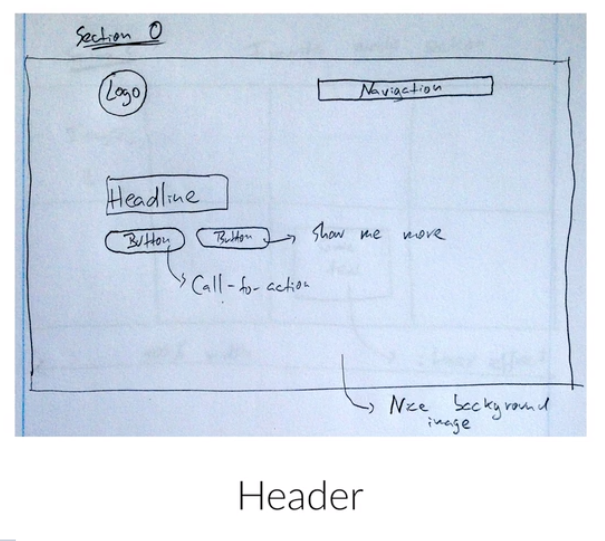

# Omnifood Plan

## Step 1: Define Goals

* Goal of Project: Show what Omnifood does, how it works, and in which cities it operates in. Then, make people sign up on a subscription plan.
* Audience: Busy peple who don't have time to co ok or don't like it. 
    
## Step 2: Plan

One--page webpage containing infoormation provided by Omnifood, with simple navigation.

* Content: provided by Omnifood in form of text document and a couple of images.
* Navigation: Also provided by Omnifood in a text document.

## Step 3: Sketch

## Step 4: Design and Develop Website

* Pick Colors and Fonts

    

    
    
* Code project --- see files in the repo: `build-responsive-real-world-websites-with-html5-css3/omnifood`
