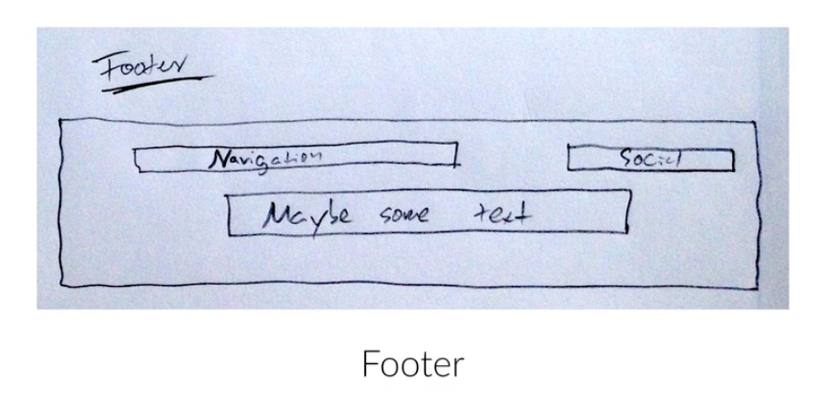

# Omnifood Plan

## Step 1: Define Goals

* Goal of Project: Show what Omnifood does, how it works, and in which cities it operates in. Then, make people sign up on a subscription plan.
* Audience: Busy peple who don't have time to co ok or don't like it. 
    
## Step 2: Plan

One--page webpage containing infoormation provided by Omnifood, with simple navigation.

* Content: provided by Omnifood in form of text document and a couple of images.
* Navigation: Also provided by Omnifood in a text document.

## Step 3: Sketch

## Step 4: Design and Develop Website

* Pick Colors and Fonts

    

    
    
* Code project --- see files in the repo: `build-responsive-real-world-websites-with-html5-css3/omnifood`
    * **resources folder** is for content created by us, **vendors folder** is for provided content from the customer
    
### Coding Sections

text content in: `../../provided_course_files/omnifood/contents/omnifood-content.docx` (also pages and rtf formats)

#### Section 0: Header

Learn:
* put text on an image
* make image darker
* make image as high as the browser viewport
* make a vertically and horizontally centered box
* design buttons
* the 4 link states in CSS: link, visited, hover, active
* CSS3 transitions for small animations
* create simple navigation

#### Section 1: Features

Learn:
* put content on a website directly from CSS with the `:after` pseudo-class
* use fluid-grid
* use icons

#### Section 2: Meals

Learn:
* make grid of images
* do a 'zoom-in' transition using only CSS
* make `` elements darker

#### Section 3: How-it-works

Learn:
* draw circles with CSS
* new technique to make separations between sections
* incorporate App Store and Play Store buttons

#### Section 4: Cities

Learn:
* use small icons aligned with text
* style generic links

#### Section 5: Customer Testimonials

Learn:
* create a new background-image effect
* effectively communicate what customers have to say

#### Section 6

Learn:

#### Section 7

Learn:

#### Section 8

Learn:
